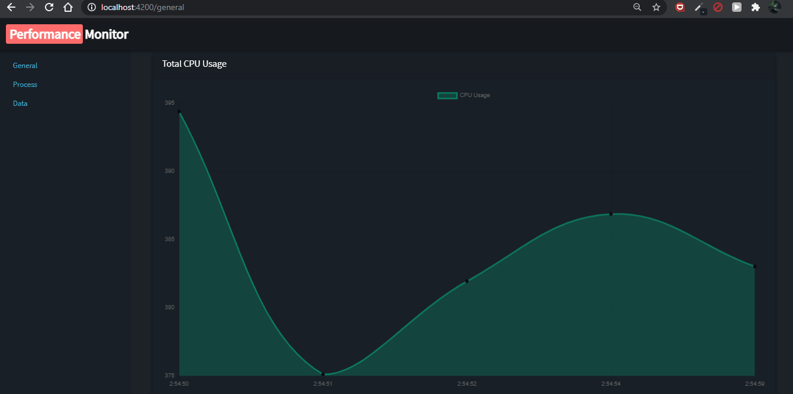
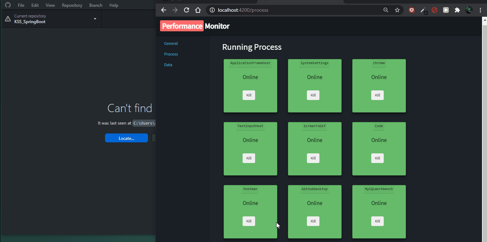
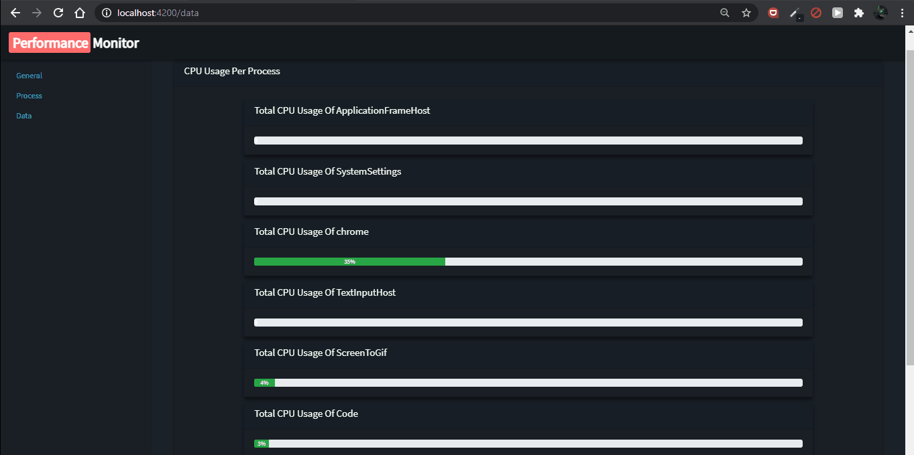

# performance-monitor

Performance monitor is an application where you can see the CPU usage on your computer and the amount of CPU used by each application.

### General

To see the total CPU usage.

To see the running application on desktop and kill them.

To see the total CPU usage for per process (application).

